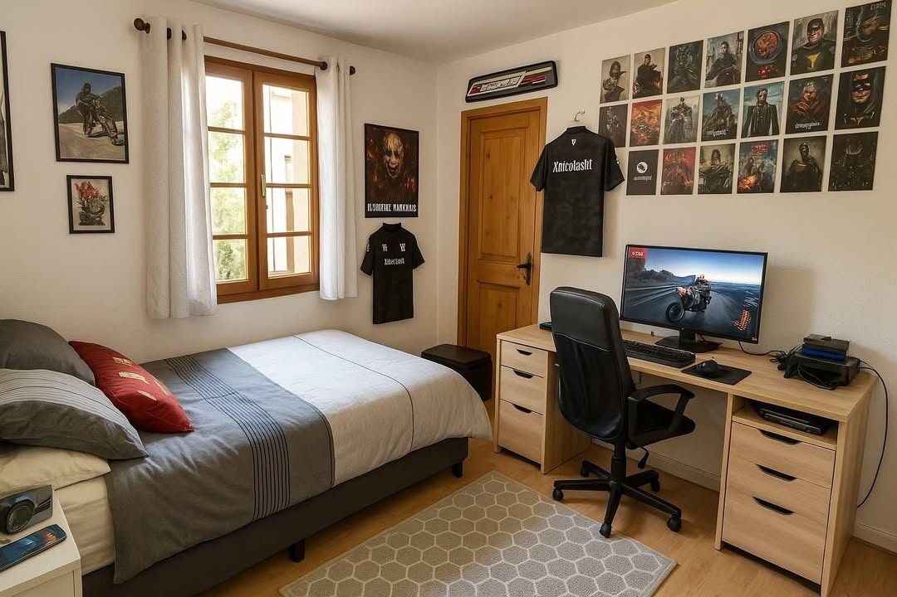
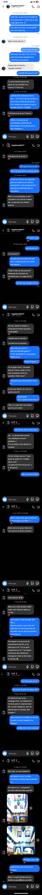
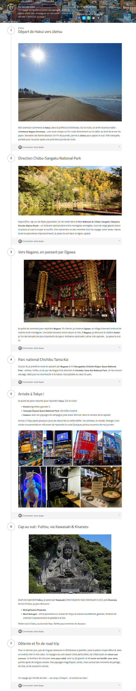
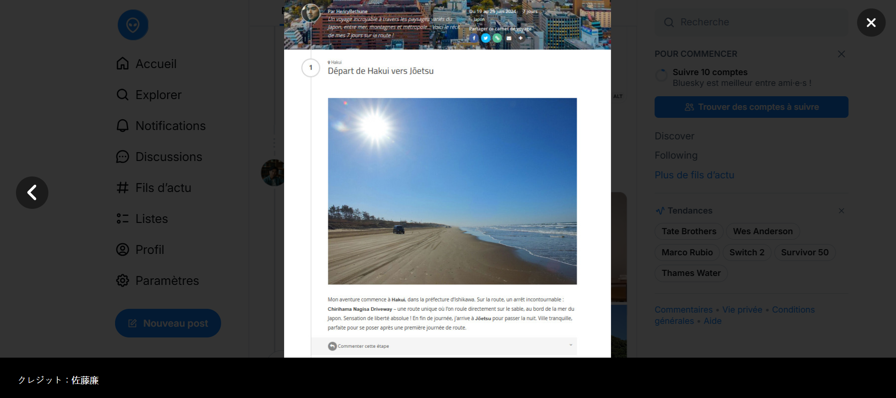
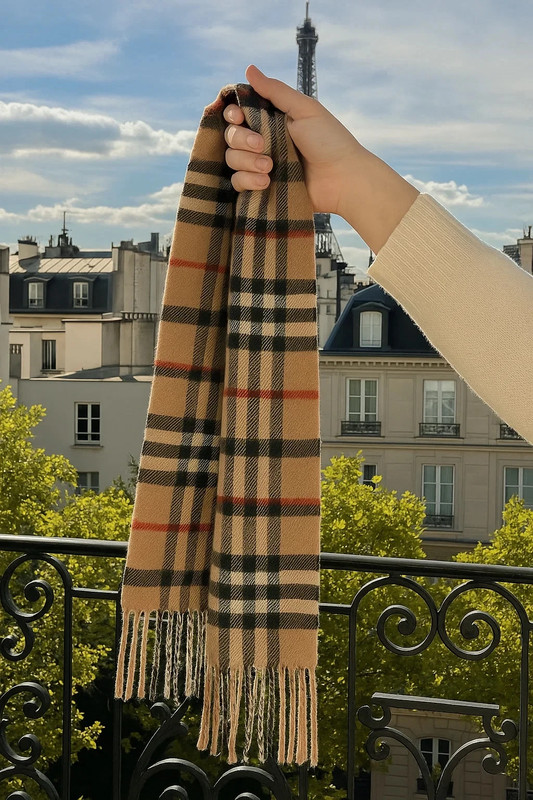
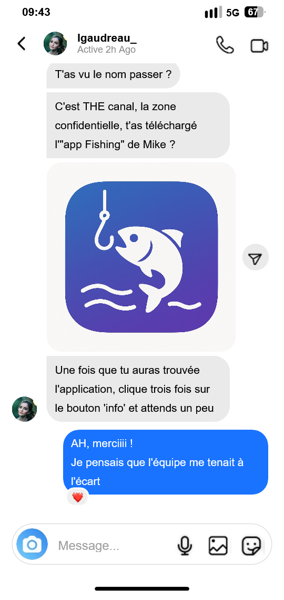
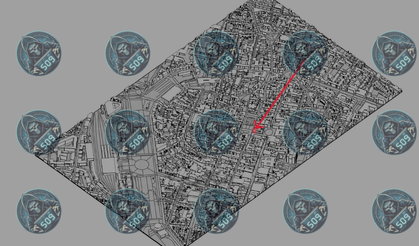
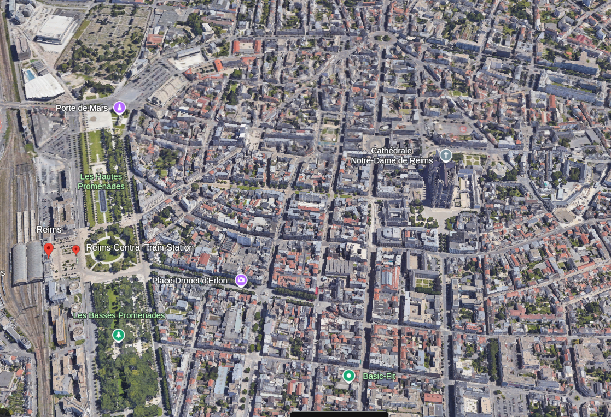

Writeup - ΦShell-M-HackÅ
====================================

Introduction
----------------

Voici notre WU de la 2eme édition du Hackosint (2025).
Résultat : Top 22 - 1576 Points

Welcome back
-----------------

Chapitre 1.

Interview
~~~~~~~~~~~~~~

*Le document précédent montre que l’interview donnée par Charlotte constitue un bon point de départ.
Pouvez-vous retrouver à quelle date cette interview a été réalisée ?
Flag format : JJ/MM/AAAA* 

On retourne sur le Twitter de Charlotte Nectoux : 

- https://x.com/CN_CumSpe?t=1QFYRGNPWeEhnPAGVdrn6g&s=09 

Dans ces tweets on peut voir qu'elle a donné une interview le : **02/02/2025**

Qui es tu ? 
~~~~~~~~~~~~~~~

*Dans cette interview, Charlotte mentionne le nom d'une personne ayant eu un comportement suspect envers elle.
Seriez-vous en mesure de nous indiquer l'identité de cette personne ?
Flag format : Henri le Montclair*

Pour retrouver l'interview on va chercher le journaliste Marc Steiner avec Google "Steiner Charlotte Nectoux"

On tombe sur ce blog medium : https://medium.com/@marcsteinerdailynews

Et on retrouve l'interview ici : https://medium.com/@marcsteinerdailynews/cybersécurité-le-piège-du-phishing-et-la-chute-du-groupe-509-60db7eab364e

Dans cette interview, Charlotte parle de **Nicolas de Richelieu**

Pseudonyme 
~~~~~~~~~~~~~~~

*Ce Nicolas semble très actif sur les réseaux. Pouvez-vous retrouver sous quel pseudonyme il se cache ?
Flag format : xhacker*

Sur facebook on retrouve un certain Nicolas de Richelieu qui semble suspect : https://www.facebook.com/profile.php?id=61576075067801 

Dans ses stories on peut voir une photo de sa chambre avec un tshirt contenant un pseudo au dos : https://www.facebook.com/stories/701492352275324/?source=profile_highlight

On récupère alors son pseudo : **xnicolasht**

Première approche 
~~~~~~~~~~~~~~~~~~~~~

*En enquêtant sur ce pseudonyme, vous découvrez un lieu rempli de secrets, qui aurait dû rester confidentiel.
Pouvez-vous déterminer depuis quand, précisément, Nicolas a commencé à échanger avec Foxtrot (ancien membre d'APT-509 arrêté en 2024) ?
Flag format : JJ/MM/AAAA*

Avec le pseudo on retrouve un compte bluesky : https://bsky.app/profile/xnicolasht.bsky.social 

Sur ce bluesky on retrouve une photo intéressante affichant un écran et son contenu. 

.. image:: ../../_static/img/hackosint/nico2.jpg
  :alt: Photo Nicolas bluesky

Sur cette image on aperçoit un partage drive avec son url, mais on ne possède pas le nom de domaine.

Heureusement dans ces follow bluesky on retrouve "Cryptpad".

On peut donc obtenir l'accès au drive via : https://cryptpad.fr/drive/#/2/drive/view/f3YGBpPsdLVDxwpvH+PfWsHBS2nNHpOgLwGr-VP9cHI

Dans ce cryptpad, on va retrouver des copies d'écrans des conversations entre lui et Hugo (personnage de l'édition précédente).

On récupère tout et on les remet dans l'ordre :

On récupère donc la date : **07/09/2023**

Ces conversations nous donne d'ailleurs beaucoup d'informations pour la suite. 

TocTocToc
~~~~~~~~~~~~~~~~~~~~~

*Grâce aux informations dont vous disposez, pouvez-vous retrouver où habite précisement Nicolas ?
Flag format : cordonnées*

Non réalisé mais on a : 
- Département de l'ain (bluesky)
- Lycée privé de saint joseph (facebook) : Bourg en Bresse ou Miribel
- Rue en travaux (conversation)
- Maison en travaux (conversation)

On a cherché beaucoup de rue en travaux via les sites des mairies mais il fallait utiliser la wayback machine.

Hotel
-----------------
Chapitre 2.

Identité
~~~~~~~~~~~~~~~~~~~~~

*En enquêtant sur le voyage de Foxtrot et Hotel à Marrakech, pouvez-vous retrouver l'identité (nom et prénom) de Hotel ?
Flag format : Léonore Dupont*

On retrouve le restaurant grâce aux photos dans la conversation entre Hugo et Nicolas : https://www.tripadvisor.fr/Restaurant_Review-g293734-d12328096-Reviews-Dar_Chef-Marrakech_Marrakech_Safi.html

En cherchant dans les avis, on retrouve le profil de Hotel : https://www.tripadvisor.fr/Profile/78478HBethune?fid=ee67eec2-4316-4828-bed3-678592c0c6a8

On obtient alors son nom et prénom : **Henry Bethune**

Un chanceux
~~~~~~~~~~~~~~~~~~~~~

*Henry semble avoir échappé aux mailles du filet lors de la première enquête en 2024.
Seriez-vous en mesure de déterminer où il se trouvait au moment de l'arrestation des premiers membres d'APT en 2024 ?
Flag Format : coordonnées*

On sait via les conversation entre Hugo et Nicolas que Henry est japonais.
On a maintenant son nom / prénom et son pseudo : 78478HBethune

On trouve alors son profil Bluesky : https://bsky.app/profile/78478hbethune.bsky.social 

Ici beaucoup d'informations sur ses voyages, et notamment son voyage au japon. 

On y trouve également un autre pseudo pour son réseau social snapchat : henrybtravel

On remet les éléments de l'autre, et on regarde aussi les autres photos de son profil.

On sait également via l'article de Marc Steiner que l'arrestation a eu lieu le 23 Juin 2024 à 11H.
Attention au décalage horaire : +7h, donc a 18h au japon

Sur une image il semble y avoir une réservation pour un restaurant ce jour là a 18h : 

En déchiffrant les kanjis avec Google Lens, on finit par retrouvé un restaurant le Wanko & Chanko 

On retrouve sa localisation dans Maps, et on saisie les coordonnées pour flag. 

Double identité
~~~~~~~~~~~~~~~~~~~~~

*Henry Bethune semble être originaire d'un autre pays.
En partant de son compte tripadvisor, pouvez-vous retrouver sa deuxième identité et nous l'indiquer dans la forme linguistiquement correcte de sa langue d’origine ?
Flag format : Jérome Lévêque*

On a bien galéré alors qu'en faites c'était facile, sur une de ses images blueskye, en bas de l'écran on peut voir des kanji apparaître : 

Les voici : クレジット：佐藤廉

Une fois traduit on obtient : Crédit : **Ren Sato**

Ou es tu ? 
~~~~~~~~~~~~~~~~~~~~~

*Pouvez-vous déterminer où se trouve actuellement Hotel ?
Flag format : Portaventura World*

Sur le snapchat d'Henry : https://www.snapchat.com/add/henrybtravel 
On peut voir une story avec plein de photos et vidéos de Disneyland Paris (tout est écrit en français).

On peut donc flag avec : **Parc Walt Disney Studio**

November
-----------------
Chapitre 3.

Révèle ton secret
~~~~~~~~~~~~~~~~~~~~~

*N'appelez/contactez aucun numéro de telephone / Do not call/contact any telephone number !
Hotel semble être en contact avec une autre personne. Il serait intéressant d’enquêter sur elle ! Pouvez-vous déterminer son identité complète (nom et prénom) ?
Flag format : Jeanne d'Arc*

Grace au snapchat d'Henry, on retrouve le snapchat de notre personnage : https://www.snapchat.com/add/lg-account 

On y trouve deux story avec son chien et au cinéma. 

Sur la story du chien on peut retrouver son numéro de téléphone : 0756834814 ou 0656834814

On ajoute les deux sur notre téléphone, et on regarde si on retrouve le contact dans WhatsApp.

Sur sa photo de profil WhatsApp on peut lire en bas a droite : LG by eliasphotography.blog

On va donc se rendre sur ce site : https://eliasphotography.blog

On ne voit aucun moyen de contacter Elias, mais il y a une newsletter. On va donc s'y inscrire. 

Quelques minutes plus tard on reçoit un email, et on obtient alors l'adresse d'Elias : eliasmphotography@outlook.com 

On va donc le contacter en lui disant qu'on a vu les photos de "LG" et qu'on est intéressé par son travail. 

Il nous réponds : Ah, greetings from the darkroom. I’m Elias Moreau — once a photographer of whispers and blurred truths. Your mention of LG transports me to a cherished collaboration with **Lea Gaudreau**, a ballet of light and shadow we danced through. As for your wedding, while the frames of joy and celebration call to me, I must first ask: have you explored the depths of your own memories captured? The right photographer can weave magic, but tell me — what do you envision beyond the frame?

On obtient alors le nom dans la réponse : **Lea Gaudreau**

Combien d'hivers
~~~~~~~~~~~~~~~~~~~~~

*L'âge est toujours un élément important, notamment pour déterminer les sanctions prévues par la loi. Pouvez-vous nous dire quel âge a Léa Gaudreau ?
Flag format : 78*

On a maintenant son pseudo : lg-account
Et son nom prénom : Lea Gaudreau

Cela va nous permettre de retrouver un compte Instagram avec IdCrawl : `Instagram <https://www.instagram.com/lgaudreau_/>`_

Sur son Instagram on peut lire : **27** ans

On récupère également son adresse email : lea.gaudreau.pro@gmail.com

HOTEL CALIFORNIA
~~~~~~~~~~~~~~~~~~~~~

*November ne semble pas avoir de lieu de résidence fixe. Pouvez-vous déterminer précisément l'appartement où elle réside actuellement ?
Flag format : cordonnées*

Avec son pseudo instagram "lgaudreau" on a également retrouvé d'autres comptes : 

Threads : https://www.threads.com/@lgaudreau_?xmt=AQF0zpUy2vE7Rt-okbOb9CP3iMlw1nm5pTTAyw_u-9IfUlU
Vinted : https://www.vinted.fr/member/266597511

Avec epieos et son email "lea.gaudreau.pro@gmail.com" on va obtenir son Calendrier Google qui contient pas mal de choses : https://calendar.google.com/calendar/u/0/embed?src=lea.gaudreau.pro@gmail.com 

Sur Thread elle indique loger dans un AirBnb avec vue sur la Tour Eiffel et dont le propriétaire s'appelle Nicolas.
Sur Vinted on retrouve une photo d'une écharpe depuis un balcon avec vu sur la Tour Eiffel

On va donc chercher tous les airbnb qui correspondent aux critères : 
- Vue sur la Tour Eiffeil
- Propriétaire Nicolas

On trouve celui ci qui ressemble fort : https://www.airbnb.fr/rooms/53885435?source_impression_id=p3_1748132934_P3e-ySq9qqqay1NY&modal=PHOTO_TOUR_SCROLLABLE 

Et on compare les photos du balcon avec les photos de l'écharpe. 

.. image:: ../../_static/img/hackosint/lea2.png
  :alt: Balcon airbnb

Ca correspond complétement
Sur Airbnb on peut avoir une localisation approximative de l'appartement, on va donc chercher via Google Earth une vue qui correspondrait. 

.. image:: ../../_static/img/hackosint/lea3.png
  :alt: Google Earth

On trouve finalement l'adresse de ce Airbnb : **13 Bd de la Tour-Maubourg au dessus du petrossian** 

CCTV
~~~~~~~~~~~~~~~~~~~~~

*Grâce aux informations en votre possession, pouvez-vous identifier un magasin très précis que November a fréquenté ? Cela nous permettrait de récupérer les enregistrements vidéo (même anciens) et d’en apprendre davantage sur elle et, potentiellement, sur son entourage.
Flag format : Avenue du colonel 7 Rue de la Liberté 75019 Paris*

Non réalisé mais on a : 

- Soit un lien avec son chien
- Soit un lien avec son Iphone

Bravo
-----------------
Chapitre 4.

Les amoureuses
~~~~~~~~~~~~~~~~~~~~~

*D’après vos découvertes concernant November, il semble qu’elle soit en couple avec un membre d’APT-509. Pouvez-vous retrouver l’identité complète (nom et prénom) de cette personne ?
Flag format : Antoine Dupont*

Sur Thread, Lea indique que sa copine joue régulièrement a un jeu de plateau avec JLMaigot
En faisant une recherche IDCrawl on trouve son compte Chess.com : https://www.chess.com/member/jlmaigot

Elle est amie avec une seule personne avec qui elle joue régulièrement : https://www.chess.com/member/chessm8_saunier

On a priori son nom de famille "Saunier" et on obtient un lien linktr.ee : linktr.ee/m8_lsaunier
Et sur Thread Léa nous donne son prénom : Lise

On a donc : **Lise Saunier**

Joyeux anniversaire
~~~~~~~~~~~~~~~~~~~~~

*Pour compléter notre dossier d'enquête, pourriez-vous nous fournir la date de naissance complète de Bravo ainsi que son département de naissance ? Grâce à ces informations, nous pourrions vérifier dans nos archives si elle est déjà impliquée dans d’autres affaires de cybercriminalité.
Flag format : JJ/MM/AAAA Yonne*

Le calendrier de Léa (https://calendar.google.com/calendar/u/0/embed?src=lea.gaudreau.pro@gmail.com )nous donne la date de son anniversaire : 14 Aout

Sur son Linktr.ee on retrouve un site : https://mymemoriegram.xyz/

On y trouve une photo d'elle avec notamment des tatouages, dont un code bar : 

Ce code est en faites un numéro de sécu : 293088400300522 

On sait donc que son mois de naissance est 08, ça colle avec le calendrier de Léa 
Son année de naissance : 1993
Et son département 84 : Le Vaucluse

On a donc : **14/08/1993 Vaucluse**

Mike
-----------------
Chapitre 5. 

L'élément clé
~~~~~~~~~~~~~~~~~~

*En analysant les différentes informations dont vous disposez sur Bravo, une conversation mentionnant une application paraît particulièrement intéressante.
Quel est l'identifiant (ID) de cette application mentionnée ?
Flag format : Flag format : tarte.aux.pommes*

On trouve sur le site de lise un ficheir robots.txt : https://mymemoriegram.xyz/robots.txt

On peut voir qu'il y a un dossier /private/ accessible uniquement avec le user-agent "bravo".

On y récupère des screenshots de conversations dont celui ci : 

On sait que l'application s'appelle Fishing, et qu'elle a été développé par Mike
A force de recherche sur le playstore on la retrouve avec "Fishing Mike 509"

On peut donc récupérer l'application et obtenir son ID : **JELAIPASNOTE**

Le côté obscur
~~~~~~~~~~~~~~~~

*Quelle drôle d'application ! Une fois lancée, celle-ci semble être une façade dissimulant les activités cybercriminelles du groupe APT-509. L’un de nos experts a analysé l'application et a constaté, en examinant son code source, qu'une adresse e-mail y était potentiellement dissimulée. Malheureusement, il n'a pas réussi à la localiser.
En naviguant sur l'application, pouvez-vous aider notre expert à retrouver cette adresse ?
Flag format : cenestpasladressemaildhackolytequonrecherche@stpneflagpasca.fr*

Dans l'application en mode sombre on retrouve cette adresse email en visitant toutes les pages : **str3etf1sher@mail.com**

Ce qui nous donne notamment son pseudo : str3etf1sher

Pardon vous êtes
~~~~~~~~~~~~~~~~~~

*Eh bien, cette application renferme de sacrés secrets ! 🎣 Cette adresse e-mail semble un bon point de départ pour retrouver Mike.
Seriez- vous capable de nous donner l’identité complète de Mike (prénom et nom) ?
Flag format : Teddy Riner*

Avec son pseudo on va trouver son compte Bluesky : https://mastodon.social/@str3etf1sher 

Et on sait déjà qu'il s'appelle Fabien via les conversations obtenues précédemment. 

On a donc : **Fabien Daucourt**

Home Sweet Home
~~~~~~~~~~~~~~~~~~

*À partir des informations dont vous disposez, pourriez-vous déterminer le nom du village où habite Mike ?
Flag format : Saint-Cirq-Lapopie*

On sait grâce a son compte Bluesky qu'il est inscrit sur un forum de pêche.
En cherchant "Forum peche Daucourt" on retrouve ce forum et son compte : https://absolu-peche.fr/profil/10018-f-daucourt 

On y obtient plein d'informations sur ses zones de pêches et aussi le nom de son bateau "Seashell Injection"

Via les infos sur les zones de pêche on va retrouver son village via ce commentaire sur le Lac de Saint Agnan: 

"Super coin découvert ce matin pour pêcher, à environ un quart d’heure de chez moi. Un petit tour par la D6, puis la D211, et quelques petits chemins à explorer en voiture.
Le tout après un bon petit déj’ pris à la boulangerie juste à côté de chez moi — parce qu’on ne va pas pêcher l’estomac vide"

On se rend dans gmaps sur le Lac, on remonte la D211 jusqu'à retrouvé la D6, puis on cherche un village qui contient une boulangerie.

On peut confirmer avec overpass turbo : 

.. code-block:: console

    [out:json][timeout:25];
    // gather results
    nwr[shop=bakery]({{bbox}});
    // print results
    out geom;

On trouve alors **Dun-les-Places**

Petit bateau 
~~~~~~~~~~~~~~~~~~

*Ce Mike semble être un passionné de pêche et comme tout bon pêcheur celui-ci est très bien équipé ! Pouvez-vous retrouver l’identifiant (code MMSI) du bateau qu’il utilise ?
Flag format : 918950185*

On peut retrouver le nom de son bateau sur le forum : Seashell Injection

On le retrouve avec MarineTraffic : https://www.marinetraffic.com/en/ais/details/ships/shipid:9565794/mmsi:912010044/imo:0/vessel:SEASHELL_INJECTION

On obtient alors son MMSI : **912010044**

Site vitrine 1
~~~~~~~~~~~~~~~~~~

*À en juger par les agissements et la méthode de travail d’APT-509, cette histoire de pêche semble bien plus complexe qu’elle n’en a l’air… et pourrait dissimuler quelque chose. Vers quel site ce bateau nous mène-t-il ?
Flag format : truewebsite.org*

Sur marinetraffic, on peut voir en naviguant sur les différentes pages : For more information, you can find us at **loueuneencre.online**

Communication
~~~~~~~~~~~~~~~~~~

*Il semble également qu'APT-509 utilise un autre canal de communication, en plus de cette application, pour échanger entre ses membres. Pourriez-vous nous préciser la date de création de cet autre canal ?
Flag format : JJ/MM/AAAA*

Dans l'application de "Fishing" on y trouve une conversation secrète en appuyant 3 fois sur infos, comme indiqué dans la conversation de Lise et Léa.

On y trouve des informations sur un canal telegram que l'on retrouve facilement : https://t.me/APT509TMP

L'enquêteur
-----------------
Chapitre 6.

L'allié
~~~~~~~~~~~~~~

Non résolu :
- Site : https://loueuneencre.online
- Wayback machine nous donne le dashboard : https://loueuneencre.online/CMNoCxqsn321.php

Il fallait regardé le code dans la wayback machine pour trouver le pseudo de l'allié. 

CyberBunker
-----------------
Chapitre 7.

Nouvelle cible 2
~~~~~~~~~~~~~~~~~~~~

*Après l’arrestation d'une partie de leurs membres en 2024, les activités du groupe APT 509 sont en net déclin. Leur attaque prévue cette même année contre la ville de Geelong, en Australie, a échoué. Par conséquent, leur trésorerie a été directement impactée. Pour tenter de se relancer, le groupe envisage désormais une cyberattaque contre un établissement français.
Pouvez-vous identifier quelle entreprise est visée par APT 509 ?
Flag format : Société nationale des chemins de fer français*

Sur telegram on a obtenu un lien cryptad : https://cryptpad.fr/drive/#/2/drive/edit/l2MS2EEV9OuI0mEnOo2rW7Xw/p/ 

Le mdp été donné dans les conversations entre Léa et Lise : kmMBRAS9J&$jonnF

On va récupérer ici beaucoup d'informations sur le groupe, et la fin de l'enquête.~

On y trouve notamment un fichier PDF avec cette image : 

On sait que cette cible se trouve dans l'Est de la france. 

Sur l'image on peut remarquer une gare. On a donc chercher les gare des grandes villes de l'Est : 

- Strasbourg
- Nancy
- Metz
- Reims 

On voit une ressemblance flagrante avec Reims : 

On peut donc retrouver l'emplacement de la flèche et trouver la cible un CIC : **Crédit industriel et commercial**

Envole toi 
~~~~~~~~~~~~~~~~

*En examinant ce drive, vous tombez sur une vidéo réalisée par un drone d’Alpha, montrant un repérage d’un nouvel emplacement potentiel pour le cyberbunker. Pouvez-vous identifier le lieu de décollage du drone ?
Flag format : cordonnées*

On trouve effectivement un lien vers une vidéo : https://vimeo.com/1079165051/4addc0ed2c?share=copy 

Sur cette image on peut voir (Google Lens) la station de ski abandonné de Saint Honoré

A force de test dans Gmaps, on finit par retrouver l'emplacement exact : https://www.google.fr/maps/place/Saint+Honor%C3%A9+1500/@44.9704883,5.8215723,830m/data=!3m1!1e3!4m6!3m5!1s0x478a7d271a7bab65:0xe7785b8c4773be4a!8m2!3d44.941634!4d5.813028!16s%2Fg%2F11kbc100rb?hl=fr&entry=ttu&g_ep=EgoyMDI1MDUyNi4wIKXMDSoASAFQAw%3D%3D 

Au niveau de relais du Tabor

Objectif Eagle
~~~~~~~~~~~~~~~~

*Cette zone semble fortement convoitée par les dronistes. Pouvez-vous identifier le modèle exact utilisé par Alpha lors de ses survols ? Cette information nous sera précieuse pour l’identifier si nous décidons de l’interpeller sur place.
Flag format : KARUISRC Gps 8*

Sur le drive on a un fichier txt "DATADRONE.txt" qui n'est pas lisible.

On va l'envoyer dans https://www.phantomhelp.com/LogViewer/upload/ 

Ce qui va nous permettre de récupérer les logs de vol et le modèle : **DJI Mavic 3**

Jour J
~~~~~~~~~~~~~~~~

*Êtes-vous en mesure de déterminer la date prévue de cette nouvelle cyberattaque menée par APT-509 ?
Flag format : JJ/MM/AAAA*

Sur le drive on trouve également un fichier .glb
On va chercher "glb viewer" dans google, et l'upload sur ce site : https://gltf-viewer.donmccurdy.com/ 

On y voit un renard dans une sphère, sur ce renard on peut voir des étiquettes avec des kanjis, qui seront finalemenet inutile.

Et une date sous les pieds du renard : **17/07/2025**

Final Coutdown
-----------------
Chapitre final

Une drôle d'entreprise
~~~~~~~~~~~~~~~~~~~~~~~~~~

*L’achat de fournitures pour la construction de leur nouveau bunker semble avoir déjà commencé. APT-509, désormais mondialement connu, ne peut plus effectuer ce type d’achats sous sa véritable identité ou celle de l’un de ses membres, sans risquer l’arrestation.
Pouvez-vous identifier sous quelle fausse identité le groupe APT-509 procède à l’acquisition de son matériel ?
Flag format : Bouygues Construction Telephonique*

Sur le drive, encore une fois, on a un devis réalisé par l'entreprise "Merlin Lenchanteur".
Dans les données exif on trouve un champ destinataire: betaoespatulaparker

On a donc le nom de l'entreprise: **Betao Espatula Parker**

Site vitrine 2
~~~~~~~~~~~~~~~~~~~~~~~~~~

*Comme toute entreprise digne de ce nom (même fictive), celle-ci dispose très probablement d’un site vitrine sur Internet.
Pouvez-vous retrouver l'adresse de ce site ?
Flag format : droledesite.com*

On a utiliser security trails pour retrouver le site : https://securitytrails.com/list/keyword/espatula%20parker  

On obtient **betaoespatulaparker.eu**

Cependant ce site est inaccessible. 

Discrétion Assuré
~~~~~~~~~~~~~~~~~~~~~~~~~~

*Ce site semble avoir été mis en ligne récemment et ne paraît pas encore entièrement sécurisé. À présent, grâce aux informations dont vous disposez, il est enfin temps d’aller rendre visite à ce fameux "Alpha".
Pouvez-vous déterminer où il se cache actuellement ?
Flag format : cordonnées*

On a réussi a accéder au site en utilisant TOR et en modifiant la conf pour sortir depuis un noeud au portugal (merci GPT)
On obtient quelques informations et notamment cette note : 

"OBJECTIF : 
Réunion trimestrielle en présentielle

MEMBRE : 
#A,#G,#N,#B,#H,#M #K?

COMMUNICATION :
T privé-509

SECURITE :
#A hébergement sécurisé au milieu de rien
#G,#N,#B,#H,#M venir tout seul, voyage solo

LIEU : 
Chez #A REFUGE : XXX - ND.3QQB"

Nous n'avons pas eu le temps d'allez plus loin.

ND.3QQB est un MapCode, on pouvait trouver l'information dans un des articles du journaliste du tout début de l'enquête.
