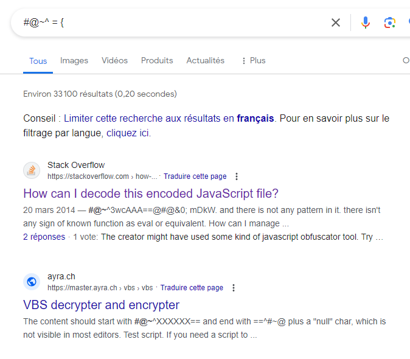
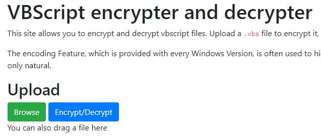

Misc - Script Encoder
===========================

Enoncé
----------

- A compléter

Fichier
-----------

- FLAG_ENCODED.txt

Résolution
-------------

Le fichier contient le code suivant : 

.. code-block:: console

    #@~^FAAAAA==\;KoP?;IqhK|31;r92"8VgYAAA==^#~@

On teste via l'identificateur de chiffrement de Decode (https://www.dcode.fr/identification-chiffrement)

Rien ne nous permet de déchiffrer le code.

Après divers essais de langage ésotérique infructueux, on remarque que le code commence par #@~^ et finit par ^#~@ (avec donc les 4 même caractères)

On suppose que cela peut correspondre à { et }

On tape donc dans Google #@~^ = {

La première réponse ne correspond pas totalement au contraire de la seconde qui a la bonne chaine de caractère

On va donc sur ce site qui permet d'encoder du vbs en vbe et inversement.

On modifie alors l'extension .txt en .vbe et on upload le fichier.
Cela nous crée un fichier vbs que l'on ouvre avec un éditeur de texte et qui contient : MCTF{SCRIPT_ENCODER}

On a donc le flag :

**MCTF{SCRIPT_ENCODER}**
 
