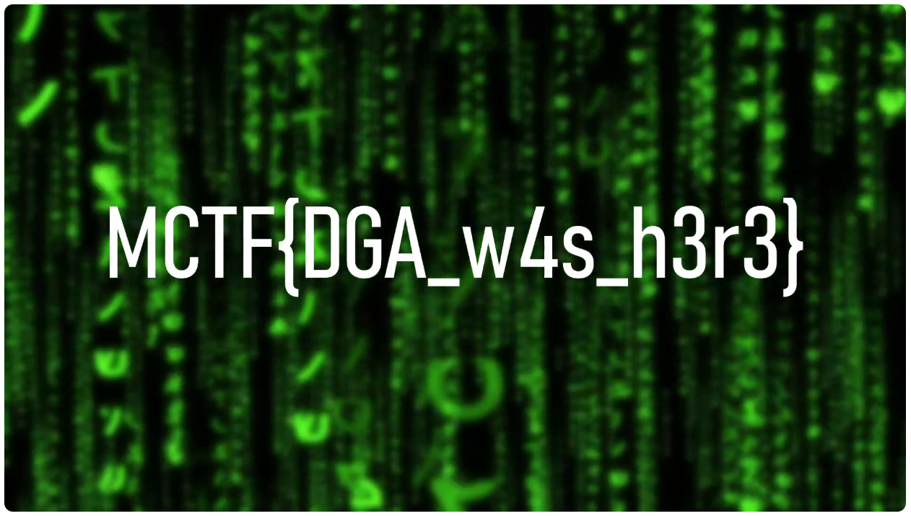

Live (OSINT) - Thanks DGA
===========================

Enoncé
----------

- A compléter

Résolution
-------------

On regarde la vidéo live Youtube MIDNIGHT CTF 2024 – QUALIFICATIONS (https://www.youtube.com/watch?v=YbOjQUK3VW8)

A la fin de la présentation de la DGA, la vidéo affiche ceci :

On a donc le flag :

**MCTF{flag{DGA_w4s_h3r3}**

