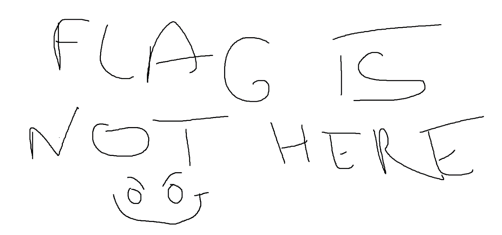
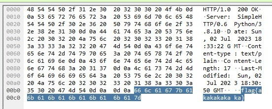

Network - Leak http
===========================

Enoncé
----------

- A compléter

Fichier
----------

- Challenge_ctf.pcap

Résolution
-------------

On ouvre le fichier dans Wireshark

On recherche le mot flag dans la liste de paquet

Une seule occurrence répond et c'est une image :

    
On recherche donc le mot flag dans le détail plutôt que dans la liste de paquet

On le retrouve dans de très nombreuses trames. On essaie donc de filtrer en http par rapport au nom du challenge.

On retrouve le mot flag dans toutes les trames. Nous affinons la recherche sur flag{

On arrive alors directement sur la bonne trame

On a donc le flag :

**MCTF{flag{akakakakaka}}**
 
