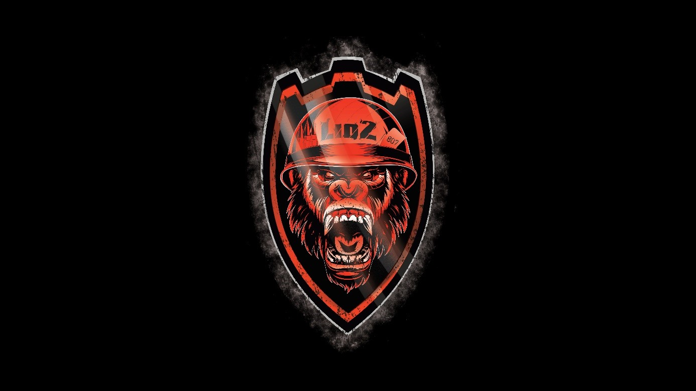

Steganography - s0uS_l3s_r4d4r
===============================

Enoncé
----------

- A compléter

Résolution
-------------

On doit trouver le message caché dans cette image : 

On vérifie des données de fichier, dont EXIF mais aucune information

On ouvre le fichier dans Aperi'Solve et dans Magic Eye Solver mais toujours aucune information

On ouvre alors le fichier dans un éditeur de texte (par exemple Notepad++)

Caractères illisibles mais recherche du mot flag

On arrive sur un bout de code :

.. code-block:: python

    import string; alph = string.ascii_letters;flag_enc = "109 115 104 110 { 130 111 131 104 111 132 108 122 123 145 104 122 149 121 118 119 149 118 123 }"
    def decode_flag(flag):
        lst = flag.split(" ")
        new_flag = ""
        for item in lst:
            if item != '{' and item != '}':
                new_flag += alph[int(item) % 25]
            else:
                new_flag += item
        print(new_flag)
    def encode_flag(flag):
        text = ""
        for i in flag:
            if i not in alph:
                text += i + " "
            else:
                text += f"{alph.index(i) + int(flag_enc.split(' ')[2])} + "
        print(text)
    decode_flag(flag_enc)

On retrouve ce qui semble être le flag encodé :

.. code-block:: console

    109 115 104 110 { 130 111 131 104 111 132 108 122 123 145 104 122 149 121 118 119 149 118 123 }

Et on voit d'un coup d'œil que le décodage transforme chaque nombre en lettre

On suppose que les quatre premiers nombres correspondent donc à flag. On a donc :

.. code-block:: console

    109 => f
    115 => l
    104 => a
    110 => g

On voit que les écarts entre les nombre et les lettre restent les même.
On en déduit donc que :

.. code-block:: console

    104 => a
    105 => b
    106 => c
    …
    128 => y
    129 => z

On peut donc remplacer chaque nombre par la lettre correspondante
Mais on tombe sur des nombres supérieurs à 129. On suppose donc que le cycle recommence et que l'on a également :

.. code-block:: console

    130 => a
    131 => b
    132 => c
    …
    154 => y
    155 => z

On arrive donc au flag : **flag{ahbahcestpastroptot}**

**Cependant, le flag est incorrect !**

On creuse alors le code. On voit qu'il remplace chaque lettre par un chiffre en se basant sur: 

.. code-block:: python

    string.ascii_letters (alph = string.ascii_letters).

En se renseignant sur cette fonction, on voit qu'elle donne a pour 0, jusqu'à 25 pour z puis A pour 26 jusque 51 pour Z, et cela correspond bien au %25 du code
Source : https://openclassrooms.com/forum/sujet/python-39138

On est donc sur des cycles de 26 en partant par 0 et alternant minuscules et majuscules

On arrive bien à 104 pour un nouveau cycle comme vu précédemment sauf qu'à partir de 130, on passe en majuscules

Le flag est donc :

**MCTF{flag{AhBahCestPasTropTot}}**
