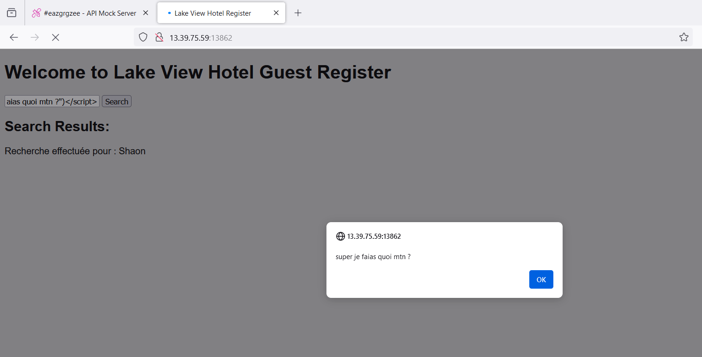
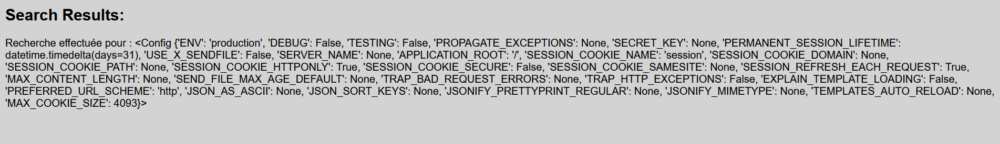

Web - Silent Hill Part 1
=============================

Enoncé
---------

- A compléter

Résolution
-------------

On a un site web avec juste un formulaire.

On obtient rapidement une xss car aucun filtre n'est appliqué sur la saisie utilisateur : 

Après avoir passer un peu de temps à essayer d'exploiter la XSS sans réelle succès, car il n'y a pas grand chose à faire avec, on tente un autre type d'attaque : **Le Server Side Template Injection**

On va donc mettre {{ 7 * 7 }} et obtenir 49 comme résultat, ce qui montre bien l'exploitabilité de la faille.

On va donc tester {{ config }} mais rien d'intéressant n'en sort : 

On tente une exécution de code directement, et on obtient le flag avec le payload suivant : 

.. code-block:: python

    {{ self._TemplateReference__context.cycler.__init__.__globals__.os.popen('cat flag.txt').read() }}