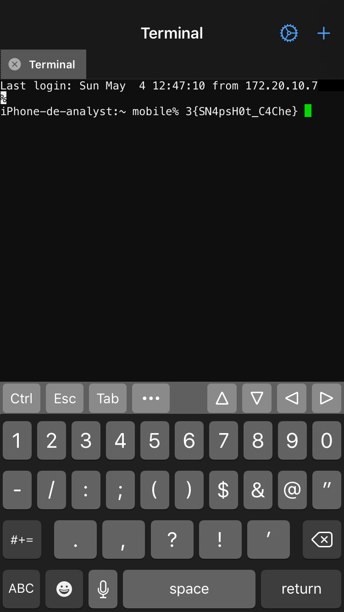

IOS Backup
===============

On a trouver un outil équivalent a aleapp pour iOS, super : https://github.com/abrignoni/iLEAPP.git

Probleme d'installation sous kali en venv, donc on va utiliser docker : 

.. code-block:: console

    # Utiliser une image Python 3.12 officielle
    FROM python:3.12-slim

    # Éviter les invites interactives pendant le build
    ENV DEBIAN_FRONTEND=noninteractive

    # Installer les dépendances système nécessaires
    RUN apt-get update && apt-get install -y --no-install-recommends \
        build-essential \
        git \
        curl \
        libffi-dev \
        libssl-dev \
        libbz2-dev \
        liblzma-dev \
        libsqlite3-dev \
        zlib1g-dev \
        ca-certificates \
        && rm -rf /var/lib/apt/lists/*

    # Créer un dossier de travail
    WORKDIR /app

    # Cloner le repo iLEAPP
    RUN git clone https://github.com/abrignoni/iLEAPP.git .

    COPY IOS_FINAL/ ./IOS_FINAL

    # (Optionnel) basculer vers une branche précise
    # RUN git checkout nom_de_branche

    # Mettre à jour pip et installer les dépendances
    RUN python -m pip install --upgrade pip setuptools wheel maturin \
    && pip install -r requirements.txt

    # Commande par défaut pour lancer l'application (à adapter)
    CMD ["python", "ileappGUI.py"]

On le lance avec :

.. code-block:: console

    sudo docker build -t ileapp-py312 .
    sudo docker run -it --rm ileapp-py312 /bin/bash
    python ileapp.py -i IOS_FINAL -o . -t fs
    sudo docker cp heuristic_lovelace:/app/iLEAPP_Reports_2025-06-27_Friday_200156 ./report

On a donc récupérer notre rapport, on va maintenant l'inspecter.

Rapidement on trouve dans les SMS : **1_flag{Db_D3Let3d_m5G}**

Dans le cache des images : **3{SN4psH0t_C4Che}**

La dernière partie est beaucoup plus complexe a trouver, on a chercher plein de type de fichier sans succès, on a regarder tous les PNG, on a chercher a obtenir les informations sur le site (adresse IP interne) visité en navigation privé, exactement

Dans les images de l'appareil photo (DCIM) on trouve 3 images, dont une avec le projet en question Kingdom Requiem.

On va chercher un peu plus d'informations sur celle ci. 

On remarque avec "file \*.PNG" quelle est différentes (RGBA) des autres (RGB).

Peut être un message caché. On a tester quelques trucs avec le LSB mais rien.

Finalement avec strings on trouve ceci : curlx9self#jumbf=c2pa.assertions/c2pa.thumbnail.ingredient.jpegdhashX 

Donc on va s'intéresser a la thumbnail : 

.. code-block:: console 

    exiftool -a -b -W %d%f_%t%-c.%s -preview:all IMG_0003.PNG 

On obtient une image similaire avec ce message en dessous de l'image : "Hidden_Pixels"

On va donc reprendre le png et le modifier avec TweakPNG, on passe la hauteur de 1200 a 1400 et on trouve la dernière partie : **H1dd3n_P1x3ls**

On a donc : **Db_D3Let3d_m5G:H1dd3n_P1x3ls:SN4psH0t_C4Che**

On fait le sha256 : b641761b66cce6d11d4b79a8440ee0faedced922ea229f8abca588748a47dc40

Et voici notre flag : **SHLK{b641761b66cce6d11d4b79a8440ee0faedced922ea229f8abca588748a47dc40}**

